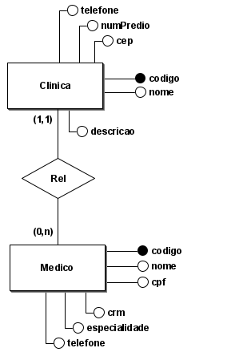

# :medical_symbol: **Frontend para gestão de clínicas e corpo médico**

Bernardo Tomasi • IFSUL • 2024

## :bookmark_tabs: Sumário
### [Sobre](#information_source-sobre_o_app) • [Tecnologias](#gear-tecnologias) • [Diagrama ER](#file_folder-diagrama_er) • [Recursos](#heavy_check_mark-recursos) • [Configuracoes](#rocket-configuracoes)
# :information_source: Sobre o App
Frontend desenvolvido utilizando React que gerencia as informações de clínicas e médicos de um sistema hospitalar. O sistema oferece uma interface gráfica para gerenciar as entidades "Clínica" e "Médico", onde cada médico está associado a uma única clínica.

# :gear: Tecnologias

# :file_folder: Diagrama ER

Atributos da clínicas:
- codigo (Chave Primária)
- nome
- telefone
- numPredio
- cep
- descricao
- Relacionamento: Cada clínica pode ter vários médicos associados (relação 1 para muitos).

Atributos de médicos: 
- codigo (Chave Primária)
- nome
- cpf
- telefone
- crm
- especialidade

Relacionamento: Cada médico deve estar associado a uma única clínica (relação muitos para 1).

# :heavy_check_mark: Recursos
O FRontend permite a criação, leitura, atualização e exclusão (CRUD) de registros de clínicas e médicos por meio de interface gráfica web. Além disso, ela gerencia o relacionamento entre médicos e clínicas.

# :rocket: Configuracoes
- Faça o download ou clone o repositório
- Acesse o diretório do projeto
- Em seu terminal, digite `npm start`
- Interaja com o app pelo localhost:3000

[↑ Back to top](#compass-compass)
